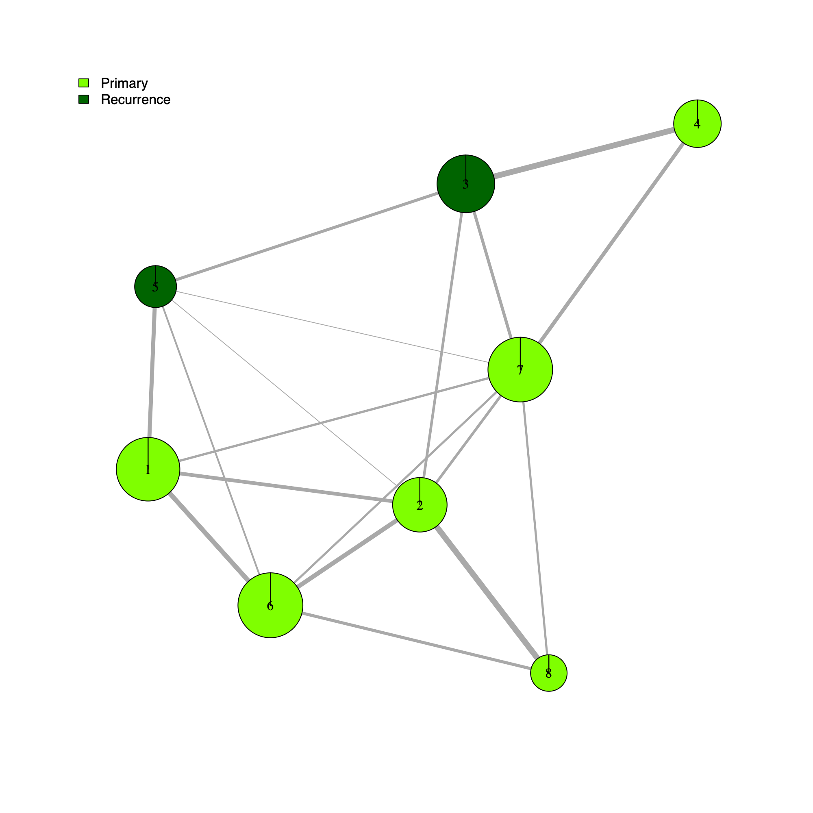
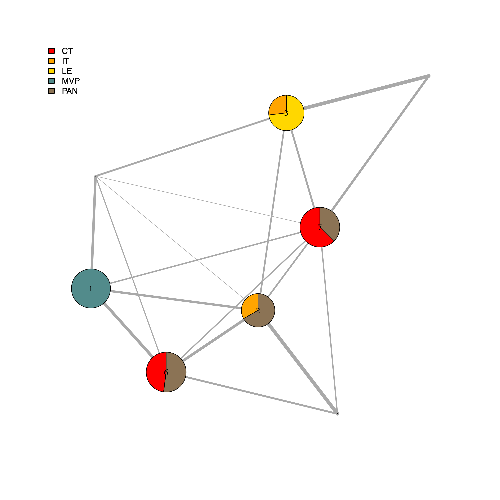
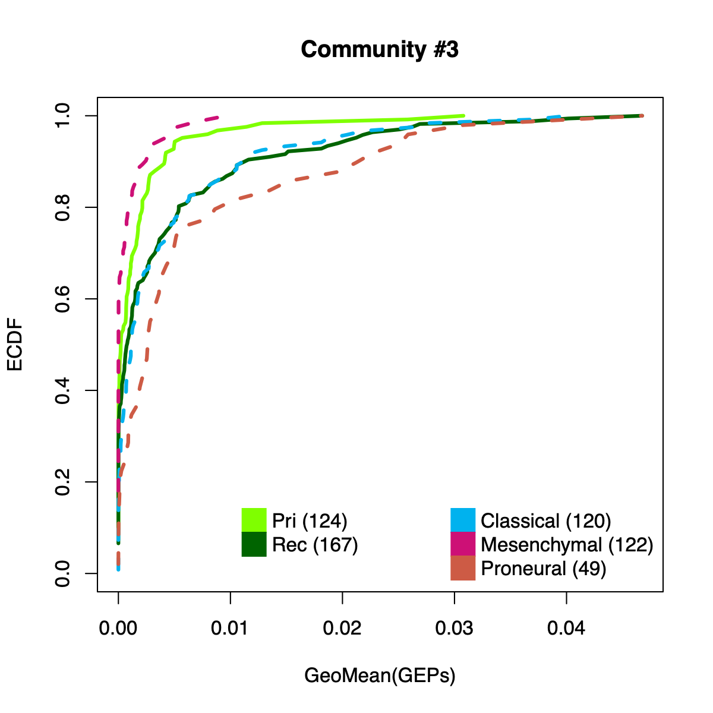
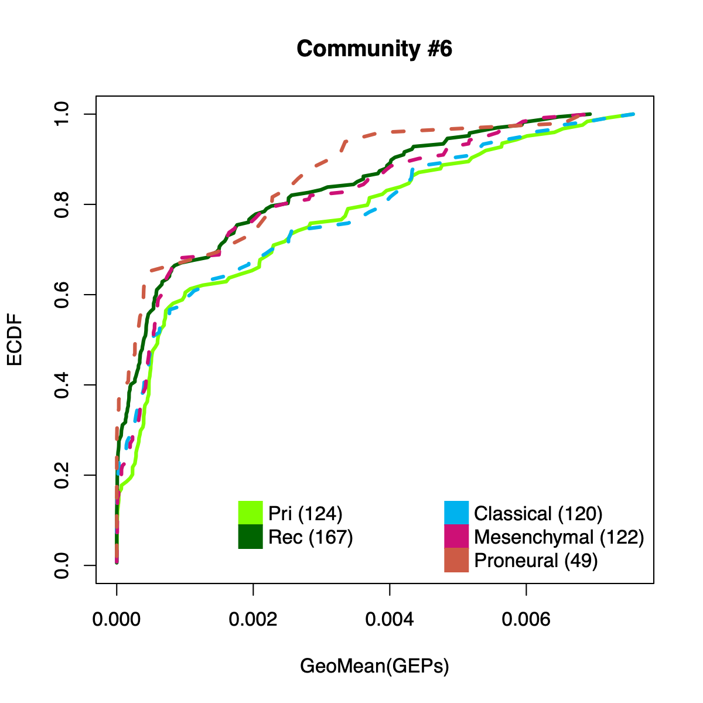
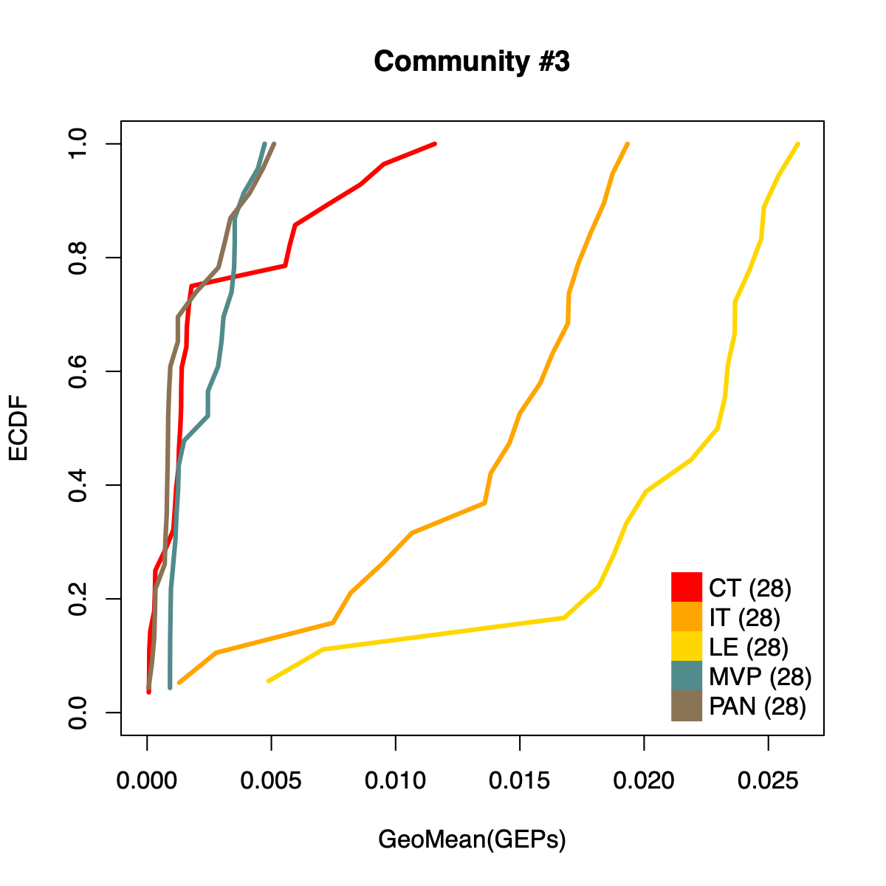
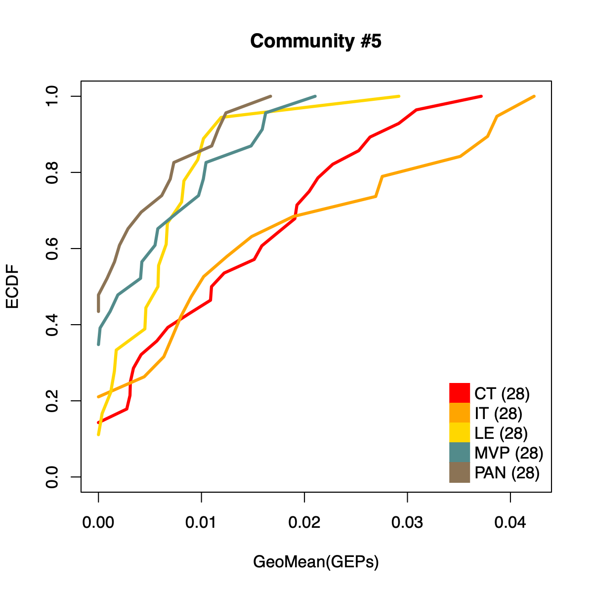
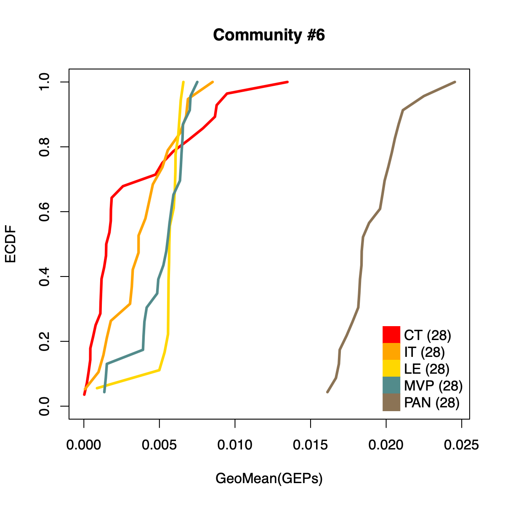
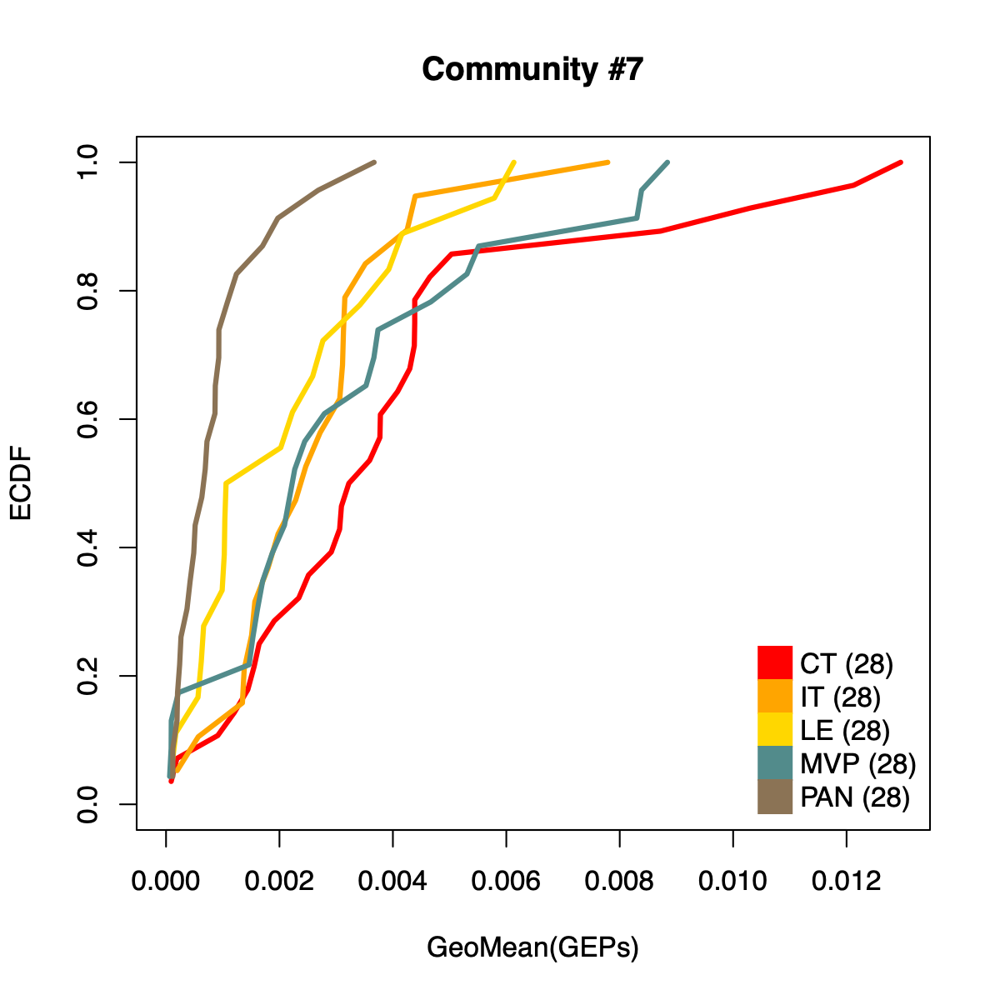

# Introduction

  - The workflows presented here annotate the community-level network
  using existing sample annotations.
  - When users have expression profiles without accompanying labels, the
  resulting network annotations can still provide an interpretive
  framework by supporting inference based on established molecular
  markers (for example, Verhaak subtype signatures), clinical context
  (for example, primary versus recurrence status), and anatomical
  features (for example, tumor core versus edge), leveraging communities
  that have already been annotated in reference cohorts.
  - The scripts in this section are not intended to be fully
  generalizable, because sample identifiers and available annotations
  can differ substantially across cohorts. For example, in the GLASS
  cohort, sample identifiers are de-identified barcodes and must be
  linked to external metadata to enable annotation. In contrast, the
  IVYGAP dataset encodes anatomical context directly in sample names,
  such that certain anatomical features may be inferred without an
  additional metadata table. 
  - Accordingly, the scripts below are
  **cohort-specific** and should be adapted as needed for other datasets
  and naming conventions.

## Directory settings

  - This block defines the working directory used throughout the demo to
  store downloaded inputs and generated outputs.

``` r
# If you want to use a user-defined output directory,
# uncomment and set the download_dir parameter.

# download_dir <- "/path/to/download" # where soObj.RDS is located

if (exists("download_dir") && is.character(download_dir) && length(download_dir) == 1 && 
        nzchar(download_dir)) {
        download_dir <- download_dir
} else {
        download_dir <- tools::R_user_dir("sotk2", "data")
}

if (!dir.exists(download_dir)) {
        dir.create(download_dir, recursive = TRUE)
        message(download_dir, " created.")
}
```

## Load the spatial omics object

  - We load the previously generated `soObj` object, which contains the
  correlation network and community detection results produced in the
  earlier steps of the workflow.
  - The script first attaches the `sotk2` package and then checks whether
  `soObj.RDS` is present in `download_dir`.

``` r
library(sotk2)

if (file.exists(file.path(download_dir, "soObj.RDS"))) {
        soObj <- readRDS(file.path(download_dir, "soObj.RDS"))
} else {
        stop("ERROR: the soObj.RDS file not found.")
}
```

## Annotation colors

  - This section defines a cohort-specific color map used to standardize
  visual annotations across figures.
  - The object `pieColors` specifies
    1.  A named color palette for IVYGAP anatomical features
    2.  Nested palettes for GLASS sample-level metadata, including
      `sampleType` (for example, Primary versus Recurrence) and
      `molecularSubtype` (for example, Classical, Mesenchymal, and
      Proneural).

``` r
pieColors <- list(
        IVYGAP = c(
                "CT" = "red",              # cellular tumor
                "IT" = "orange",           # infiltrating tumor     
                "LE" = "gold",             # tumor’s leading edge 
                "MVP" = "darkslategray4",  # microvascular proliferations
                "PAN" = "burlywood4"       # palisading cells around necrosis
        ),
        GLASS = list(
                "sampleType" = c(
                        "Primary" = "chartreuse1", 
                        "Recurrence" = "darkgreen"
                ),
                "molecularSubtype" = c(
                        "Classical" = "deepskyblue2", 
                        "Mesenchymal" = "deeppink3", 
                        "Proneural" = "coral3"
                )
        )
)
```

## User-defined functions

  - This section defines helper functions that translate cohort-specific
  sample identifiers into index sets used for downstream annotation and
  visualization. Because naming conventions and available metadata
  differ by cohort, these utilities provide a reproducible way to map
  samples to biologically meaningful groups.
    1.  `.getIVYGAPidx()` parses IVYGAP sample identifiers to extract
      abbreviated anatomical region labels (for example, CT, IT, LE,
      MVP, PAN) based on the encoded naming pattern, and returns indices
      for each region class.
    2.  `.getGLASSidx()` maps GLASS sample identifiers to phenotype
      categories using an external metadata table (`db`), returning
      indices for sample type (Primary versus Recurrence) and molecular
      subtype (Classical, Mesenchymal, Proneural).
    3.  `geoMean()` computes the geometric mean and can be used to
      summarize metagene usage (or other positive-valued quantities) at
      the sample, community, or cohort level. This summary is often
      useful for comparing relative activity across communities while
      reducing sensitivity to extreme values.

``` r
.getIVYGAPidx <- function(x) {
        ctIdx <- c(); itIdx <- c(); leIdx <- c(); mvpIdx <- c(); panIdx <- c()

        if (!is.null(x)) {
                region <- stringr::str_sub(
                        sapply(stringr::str_split(x, "__"), "[[", 2), 0, 3
                )
                ctIdx <- which(region == "Cel")
                itIdx <- which(region == "Inf")
                leIdx <- which(region == "Lea")
                mvpIdx <- which(region == "Mic")
                panIdx <- which(region == "Pse")
        }

        return(list(CT = ctIdx, IT = itIdx, LE = leIdx, MVP = mvpIdx, PAN = panIdx)) 
}

.getGLASSidx <- function(x, db) {
        priIdx <- c(); recIdx <- c()
        claIdx <- c(); mesIdx <- c(); proIdx <- c()

        if (!is.null(x)) {
                sub <- db[which(rownames(db) %in% x), c("sample_type", "Subtype")]
                priIdx <- which(sub$sample_type == "Primary")
                recIdx <- which(sub$sample_type == "Recurrence")
                claIdx <- which(sub$Subtype == "Classical")
                mesIdx <- which(sub$Subtype == "Mesenchymal")
                proIdx <- which(sub$Subtype == "Proneural")
        }

        return(list(
                "sampleType" = list(Pri = priIdx, Rec = recIdx), 
                "molecularSubtype" = list(Cla = claIdx, Mes = mesIdx, Pro = proIdx)
        ))
}

geoMean <- function(x) exp(mean(log(x)))
```

## Community annotation 
  - This section annotates the community-level network using GLASS sample
  metadata and renders a community-level visualization in which each
  community node is summarized by the distribution of sample types
  (Primary versus Recurrence) and molecular subtypes (Classical,
  Mesenchymal, Proneural).
  - The pie encodes standardized residuals from a chi-squared test, defined as `residual = (observed - expected) / sqrt(expected)`.
    - Larger positive residuals indicate an over-representation of the category relative to the null expectation, whereas larger negative residuals indicate an under-representation.
    - The magnitude of the residual reflects the strength of deviation from independence, with values further from zero providing stronger evidence that the observed frequency differs meaningfully from the expected frequency under the Chi-squared model.

### [GLASS] Primary vs. Recurrence
  - Briefly, the code (i) extracts metagene-to-community assignments from
  the correlation network, (ii) loads the GLASS annotation table
  (`annot_GLASS.RDS`), and (iii) aggregates, for each community, the set
  of samples associated with its constituent GEPs (via the GLASS
  metagene-to-sample mapping).
  - The helper function `.getGLASSidx()` is then used to map those samples
  to metadata-defined groups, and the resulting counts are stored as a
  per-community "pie" vector.
  - Communities with non-zero counts are displayed with appropriately
  scaled node sizes and labels.

``` r
corNetwork <- soObj@corNetwork
clusterMembership <- soObj@sample2metagene
community <- c(1:length(soObj@commCols))
commNetwork <- soObj@commNetwork

allGEPs <- data.frame(
        Data = sapply(stringr::str_split(igraph::V(corNetwork)$name, "\\$"), "[[", 1), 
        GEP = igraph::V(corNetwork)$name,
        Community = igraph::V(corNetwork)$community
)

if (file.exists(file.path(download_dir, "annot_GLASS.RDS"))) {
        glassAnnot <- readRDS(file.path(download_dir, "annot_GLASS.RDS"))
        message("annot_GLASS.RDS file imported.")
} else {
        stop("Please download annot_GLASS.RDS by running 03_download.R.")
}
```

    ## annot_GLASS.RDS file imported.

``` r
dName <- "GLASS"
legend <- names(pieColors[[dName]][["sampleType"]])
legendCol <- pieColors[[dName]][["sampleType"]]

cl <- clusterMembership[[dName]]
subGEPs <- allGEPs[which(allGEPs$Data == dName),]

# init
vertexLabel <- rep("", length(community)); names(vertexLabel) <- community
vertexSize <- rep(0.1, length(community)); names(vertexSize) <- community
vertexPie <- rep_len(list(numeric(length(legend))), length(community))
names(vertexPie) <- paste0("Community_", community)

for (whichComm in community) {
message(whichComm)
        commName <- paste0("Community_", whichComm)
        commSpecificGEPs <- subGEPs[which(subGEPs$Community == whichComm),]
        if (nrow(commSpecificGEPs) > 0) {
                allSamples <- c()
                for (gep in commSpecificGEPs$GEP) {
                        allSamples <- c(allSamples, cl[[gep]])
                }
                noSamples <- .getGLASSidx(unique(allSamples), glassAnnot)
                noSamples <- sapply(noSamples[["sampleType"]], length)
                
                if (sum(noSamples) != 0) {
                        vertexPie[[commName]] <- noSamples
                        vertexSize[whichComm] <- igraph::V(commNetwork)$size[whichComm]
                        vertexLabel[whichComm] <- igraph::V(commNetwork)$name[whichComm]
                } 
        }
}

vertexInfo <- list(
        vertexLabel = vertexLabel, 
        vertexSize = vertexSize, 
        vertexPie = vertexPie, 
        legend = legend, 
        legendCol = legendCol
)
plotCommNetwork(soObj, vertexInfo = vertexInfo, filename = NULL)
```



### [GLASS] Molecular subtypes

``` r
legend <- names(pieColors[[dName]][["molecularSubtype"]]) # Verhaak
legendCol <- pieColors[[dName]][["molecularSubtype"]]

# init
vertexLabel <- rep("", length(community)); names(vertexLabel) <- community
vertexSize <- rep(0.1, length(community)); names(vertexSize) <- community
vertexPie <- rep_len(list(numeric(length(legend))), length(community)); names(vertexPie) <- paste0("Community_", community)

for (whichComm in community) {
        commName <- paste0("Community_", whichComm)
        commSpecificGEPs <- subGEPs[which(subGEPs$Community == whichComm),]
        if (nrow(commSpecificGEPs) > 0) {
                allSamples <- c()
                for (gep in commSpecificGEPs$GEP) {
                        allSamples <- c(allSamples, cl[[gep]])
                }
                noSamples <- .getGLASSidx(unique(allSamples), glassAnnot)
                noSamples <- sapply(noSamples[["molecularSubtype"]], length)
                
                if (sum(noSamples) != 0) {
                        vertexPie[[commName]] <- noSamples
                        vertexSize[whichComm] <- igraph::V(commNetwork)$size[whichComm]
                        vertexLabel[whichComm] <- igraph::V(commNetwork)$name[whichComm]
                } 
        }
}

vertexInfo <- list(vertexLabel = vertexLabel, vertexSize = vertexSize, vertexPie = vertexPie, legend = legend, legendCol = legendCol)
plotCommNetwork(soObj, vertexInfo = vertexInfo, filename = NULL)
```


### [IVYGAP] Anatomical features

- This section annotates the community-level network using IVYGAP
  anatomical context derived directly from sample identifiers and
  generates a community-level plot summarizing the anatomical
  composition of each community.
- For each community, the script aggregates the set of samples
  associated with its constituent GEPs (via the IVYGAP
  metagene-to-sample mapping) and then applies `.getIVYGAPidx()` to
  parse sample names into anatomical region categories.
- The resulting category counts are stored as a per-community "pie"
  vector and used to render pie-chart node annotations, with node size
  and labels inherited from the community network.

``` r
dName <- "IVYGAP"
legend <- c("Cellular_Tumor", "Infiltrating_Tumor", "Leading_Edge", "Microvascular_proliferation", "Pseudopalisading_cells_around_necrosis")
legendLbl <- names(pieColors[[dName]])
legendCol <- pieColors[[dName]]

cl <- clusterMembership[[dName]]
subGEPs <- allGEPs[which(allGEPs$Data == dName),]

# init
vertexLabel <- rep("", length(community)); names(vertexLabel) <- community
vertexSize <- rep(0.1, length(community)); names(vertexSize) <- community
vertexPie <- rep_len(list(numeric(length(legend))), length(community)); names(vertexPie) <- paste0("Community_", community)

for (whichComm in community) {
        commName <- paste0("Community_", whichComm)
        commSpecificGEPs <- subGEPs[which(subGEPs$Community == whichComm),]
        if (nrow(commSpecificGEPs) > 0) {
                allSamples <- c()
                for (gep in commSpecificGEPs$GEP) {
                        allSamples <- c(allSamples, cl[[gep]])
                }
                noSamples <- .getIVYGAPidx(unique(allSamples))
                noSamples <- sapply(noSamples, length)
                
                if (sum(noSamples) != 0) {
                        vertexPie[[commName]] <- noSamples
                        vertexSize[whichComm] <- igraph::V(commNetwork)$size[whichComm]
                        vertexLabel[whichComm] <- igraph::V(commNetwork)$name[whichComm]
                } 
        }
}
vertexInfo <- list(vertexLabel = vertexLabel, vertexSize = vertexSize, vertexPie = vertexPie, legend = legend, legendLbl = legendLbl, legendCol = legendCol)
plotCommNetwork(soObj, vertexInfo = vertexInfo, filename = NULL)
```



## Community-level NMF usages

  - This section quantifies and visualizes community-level activity by
  summarizing metagene usage patterns derived from the cNMF results.
  - For each cohort (GLASS and IVYGAP), the script iterates over inferred
  communities and performs the following steps:
    1.  Identifies the set of metagenes assigned to the current community
      and restricts them to the cohort of interest
    2.  Extracts the corresponding NMF usage profiles (H/coef matrix) from
      the fitted NMF object
    3.  Normalizes metagene usage across samples to obtain a comparable,
      compositional usage profile
    4.  Aggregates usage across all community member metagenes by
      computing the geometric mean per sample.
    5.  The resulting per-sample activity estimates are then stratified by
      cohort-specific annotations (for example, sample type and
      molecular subtype in GLASS; anatomical regions in IVYGAP) and
      visualized using empirical cumulative distribution functions
      (ECDFs).
  - Users can compute the geometric mean of metagene usage (from the
  NMF results) to identify communities with stronger or weaker activity
  and to reduce the risk of misinterpretation.
  - The ECDF plots provide a compact comparison of community activity
  distributions across annotation groups:
    - They address questions such as how Community #1 and #6 differ when both appear Primary-associated based on Chi-squared residual patterns. In particular, summarizing community activity using the geometric mean of metagene usage reveals that Primary samples exhibit higher usage in Community #1, whereas Recurrence samples exhibit higher usage in Community $6. This divergence indicates that Community 1 is more plausibly interpreted as a Primary-enriched module, while Community 6 may reflect a recurrence-associated or mixed activity pattern despite similar residual-based enrichment profiles.

### GLASS

``` r
glass <- readRDS(file.path(download_dir, "nmfRes_GLASS.RDS"))
ivygap <- readRDS(file.path(download_dir, "nmfRes_IVYGAP.RDS"))
dataL <- list(GLASS = glass, IVYGAP = ivygap)

dName <- "GLASS"
nmfObj <- dataL[[dName]]
nodes <- igraph::V(soObj@corNetwork)
community <- nodes$community
names(community) <- nodes$name

for (comm in c(1:length(soObj@commCols))) {
        metagenes <- names(community)[which(community == comm)]
        metagenes <- metagenes[which(
                sapply(stringr::str_split(metagenes, "\\$"), "[[", 1) == dName)]

        if (length(metagenes) > 0) {
                usageMat <- c()
                for (metagene in metagenes) {
                        buff <- unlist(stringr::str_split(metagene, "\\$"))
                        k <- as.numeric(buff[3])
                        rank <- as.numeric(buff[2])
                        
                        usage <- NMF::coef(get(as.character(k), nmfObj$fit))
                        
                        rowSum <- apply(usage, 1, sum)
                        nUsage <- usage/rowSum
                        usageMat <- rbind(usageMat, nUsage[rank,])
                }

                usageMat[usageMat == 0] <- 1E-08
                rep <- apply(usageMat, 2, geoMean)
                names(rep) <- colnames(usageMat)

                idx <- .getGLASSidx(names(rep), glassAnnot)

                priIdx <- idx[["sampleType"]][["Pri"]]
                recIdx <- idx[["sampleType"]][["Rec"]]
                claIdx <- idx[["molecularSubtype"]][["Cla"]]
                mesIdx <- idx[["molecularSubtype"]][["Mes"]]
                proIdx <- idx[["molecularSubtype"]][["Pro"]]

                pri <- rep[priIdx]; pri <- pri[order(pri)]; priF <- ecdf(rep[priIdx])
                rec <- rep[recIdx]; rec <- rec[order(rec)]; recF <- ecdf(rep[recIdx])
                cla <- rep[claIdx]; cla <- cla[order(cla)]; claF <- ecdf(rep[claIdx])
                mes <- rep[mesIdx]; mes <- mes[order(mes)]; mesF <- ecdf(rep[mesIdx])
                pro <- rep[proIdx]; pro <- pro[order(pro)]; proF <- ecdf(rep[proIdx])
                
                plot(pri, priF(pri), col="chartreuse1", xlab="GeoMean(GEPs)", 
                        ylab="ECDF", main=paste0("Community #", comm), 
                        type="l", lwd=3, xlim=c(0, max(rep)), ylim=c(0, 1)
                )
                lines(rec, recF(rec), col="darkgreen", lwd=3)
                lines(cla, claF(cla), col="deepskyblue2", lwd=3, lty=2)
                lines(mes, mesF(mes), col="deeppink3", lwd=3, lty=2)
                lines(pro, proF(pro), col="coral3", lwd=3, lty=2)
                
                legend("bottomright", 
                        legend=c(
                                paste0("Pri (", length(priIdx), ")"), 
                                paste0("Rec (", length(recIdx), ")"),
                                NA, 
                                paste0("Classical (", length(claIdx), ")"),
                                paste0("Mesenchymal (", length(mesIdx), ")"),
                                paste0("Proneural (", length(proIdx), ")")
                        ),
                        col = c("chartreuse1", "darkgreen", NA, 
                                "deepskyblue2", "deeppink3", "coral3"
                        ), 
                        pch = 15, pt.cex = 2.8,
                        bty="n", ncol=2
                )
        } else {
                message(paste0("No metagenes in Community #", comm))
        }
}
```








### IVYGAP

``` r
dName <- "IVYGAP"
nmfObj <- dataL[[dName]]
nodes <- igraph::V(soObj@corNetwork)
community <- nodes$community
names(community) <- nodes$name

for (comm in c(1:length(soObj@commCols))) {
        metagenes <- names(community)[which(community == comm)]
        metagenes <- metagenes[which(
                sapply(stringr::str_split(metagenes, "\\$"), "[[", 1) == dName)]

        if (length(metagenes) > 0) {
                usageMat <- c()
                for (metagene in metagenes) {
                        buff <- unlist(stringr::str_split(metagene, "\\$"))
                        k <- as.numeric(buff[3])
                        rank <- as.numeric(buff[2])
                        
                        usage <- NMF::coef(get(as.character(k), nmfObj$fit))
                        
                        rowSum <- apply(usage, 1, sum)
                        nUsage <- usage/rowSum
                        usageMat <- rbind(usageMat, nUsage[rank,])
                }
        
                usageMat[usageMat == 0] <- 1E-08
                rep <- apply(usageMat, 2, geoMean)
                names(rep) <- colnames(usageMat)

                idx <- .getIVYGAPidx(names(rep))
                ctIdx <- idx[["CT"]]
                itIdx <- idx[["IT"]]
                leIdx <- idx[["LE"]]
                mvpIdx <- idx[["MVP"]]
                panIdx <- idx[["PAN"]]
                
                ct <- rep[ctIdx]; ct <- ct[order(ct)]; ctF <- ecdf(rep[ctIdx])
                it <- rep[itIdx]; it <- it[order(it)]; itF <- ecdf(rep[itIdx])
                le <- rep[leIdx]; le <- le[order(le)]; leF <- ecdf(rep[leIdx])
                mvp <- rep[mvpIdx]; mvp <- mvp[order(mvp)]; mvpF <- ecdf(rep[mvpIdx])
                pan <- rep[panIdx]; pan <- pan[order(pan)]; panF <- ecdf(rep[panIdx])
                
                plot(ct, ctF(ct), col="red", xlab="GeoMean(GEPs)", ylab="ECDF", 
                        main=paste0("Community #", comm), 
                        type="l", lwd=3, xlim=c(0, max(rep)), ylim=c(0, 1)
                )
                lines(it, itF(it), col="orange", lwd=3)
                lines(le, leF(le), col="gold", lwd=3)
                lines(mvp, mvpF(mvp), col="darkslategray4", lwd=3)
                lines(pan, panF(pan), col="burlywood4", lwd=3)
                
                legend("bottomright", 
                        legend=c(
                                paste0("CT (", length(ctIdx), ")"),  
                                paste0("IT (", length(ctIdx), ")"), 
                                paste0("LE (", length(ctIdx), ")"), 
                                paste0("MVP (", length(ctIdx), ")"), 
                                paste0("PAN (", length(ctIdx), ")")
                        ),
                        col = c("red", "orange", "gold", "darkslategray4", "burlywood4"), 
                        pch = 15, pt.cex = 2.8,
                        bty="n", ncol=1
                )
        } else {
                message(paste0("No metagenes in Community #", comm))
        }
}
```

    ## No metagenes in Community #4
    ## No metagenes in Community #8







## Community-assigned Visium spots

  - The script below illustrates a representative visualization for a single Visium sample (`UKF269_T`) and generates a two-panel figure:
    1. Seurat SNN (shared nearest neighbor) clustering results.
    2. `sotk2` community annotations, where each spot may be associated with multiple communities.
  - This section requires the **full** demo dataset from Zenodo, including the Visium object (`UKF269_T_Visium.RDS`) and the spot-level community assignments (`UKF269_T_spots.RDS`).
  - The workflow proceeds by loading and updating the Seurat object, harmonizing spot identifiers, defining color palettes for both SNN clusters and community labels, and then producing side-by-side spatial plots. Spots without community assignments are explicitly labeled as excluded (“Exc”), and spots assigned to multiple communities are summarized by concatenating community identifiers (with multi-community assignments beyond pairwise combinations collapsed into a single label for visualization).

``` r
# download_dir <- "/path/to/download" # where the demo .RDS files are located

library(Seurat)
library(stringr)
library(ggplot2)
library(gridExtra)
```

``` r
if (file.exists(file.path(download_dir, "UKF269_T_Visium.RDS"))) {
        seuratObj <- readRDS(file.path(download_dir, "UKF269_T_Visium.RDS"))
        seuratObj <- Seurat::UpdateSeuratObject(seuratObj)
        seuratObj <- Seurat::RenameCells(seuratObj, add.cell.id = "269_T_")
        visSpots <- readRDS(file.path(download_dir, "UKF269_T_spots.RDS")) # Community annotations
}

snnCol <- c("#1B9E77", "#D95F02", "#7570B3", "#E7298A", "#66A61E", "#E6AB02", "#A6761D", "#666666", "#8DD3C7", "#FB8072", "#80B1D3", "#FDB462", "#B3DE69")
names(snnCol) <- c("0", "1", "2", "3", "4", "5", "6", "7", "8", "9", "10", "11", "12") 

commCol <- c("#A6761D", "#66A61E", "#1B9E77", "#E7298A", "magenta", "grey50", "#D95F02", "#7570B3", "#8DD3C7", "beige", "#ececec")
names(commCol) <- c("9-10", "10", "5-10", "5", "2-5", "Exc", "2", "2-10", "2-9", "2", "0")

SpatialDimPlot(
                seuratObj, 
                group.by = "seurat_clusters", 
                label = TRUE, label.size = 3, 
                pt.size.factor = 250) + 
        theme(legend.position = "right") + 
        labs(title = "UKF269_T, SNN") + 
        scale_fill_manual(values = snnCol[levels(seuratObj@meta.data$seurat_clusters)]) 
```


``` r
excluded <- c(); community <- c()
for (spotName in rownames(seuratObj@meta.data)) {
        if (spotName %in% names(visSpots)) {
                comm <- paste(sort(unlist(visSpots[spotName])), collapse="-")
                if (str_count(comm, "-") > 1) comm <- 0
        } else {
                comm <- "Exc"
                excluded <- c(excluded, spotName)
        }
        community <- c(community, comm)
}

community <- factor(community)
seuratObj@meta.data$community <- community

SpatialDimPlot(seuratObj, 
                group.by = "community", 
                label = TRUE, label.size = 3, 
                pt.size.factor = 250) + 
        theme(legend.position = "right") + 
        labs(title = "UKF269_T, Community") + 
        scale_fill_manual(values = commCol[levels(community)]) 
```


