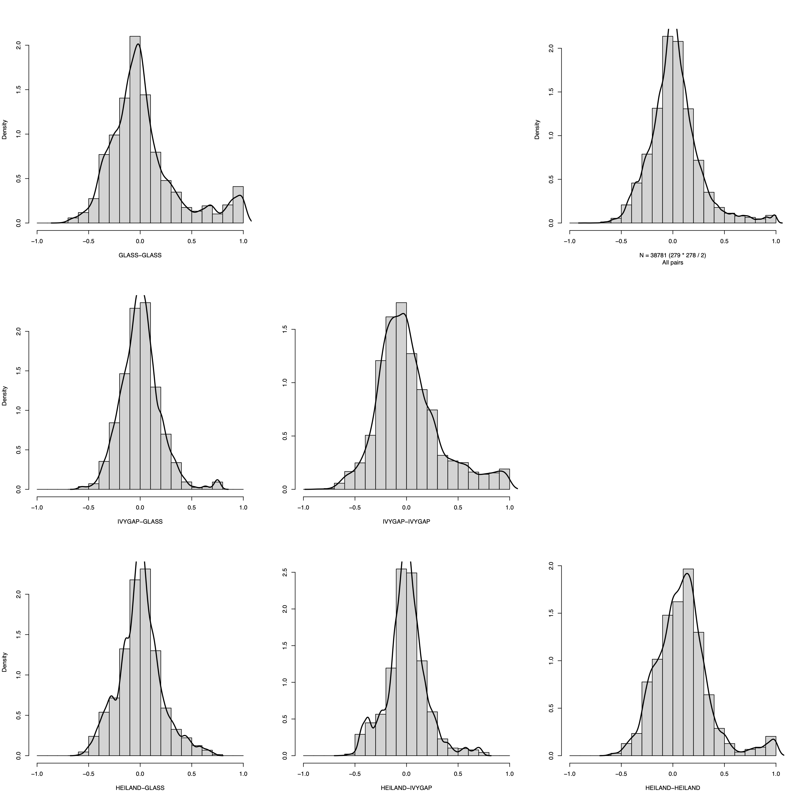
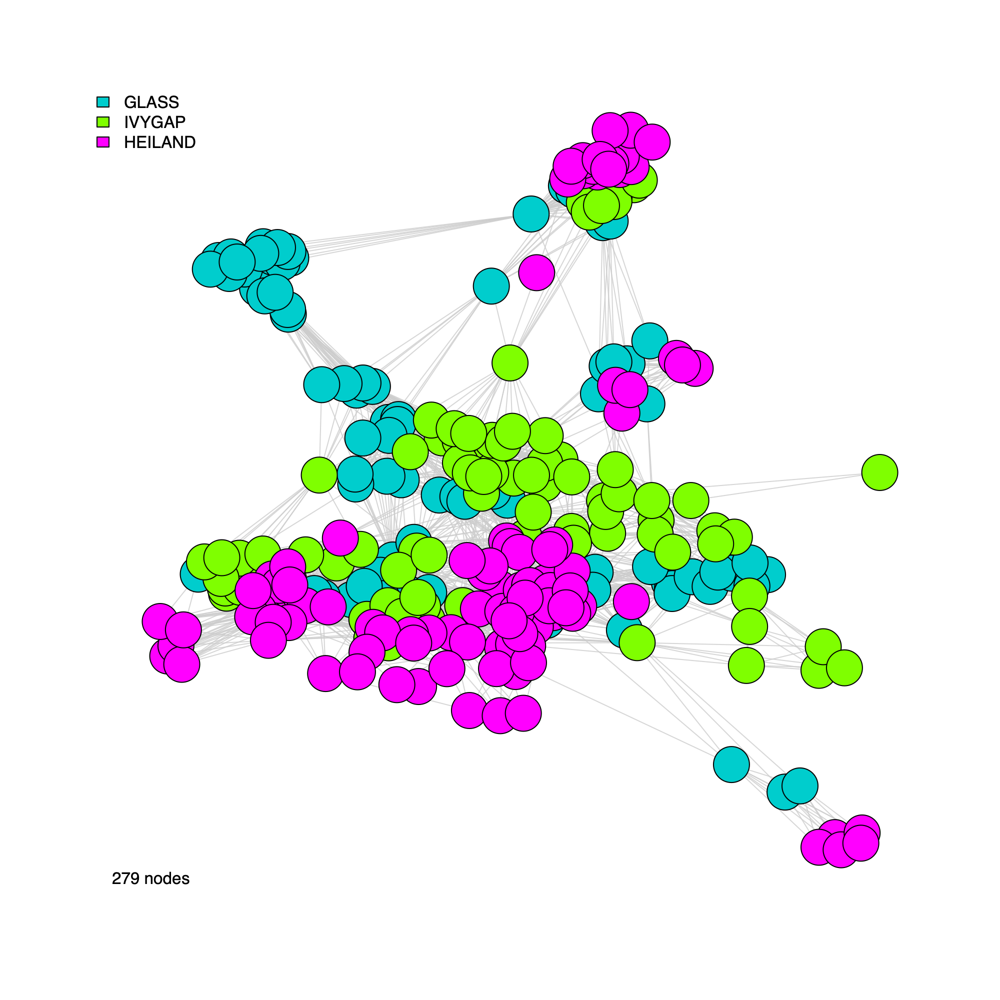
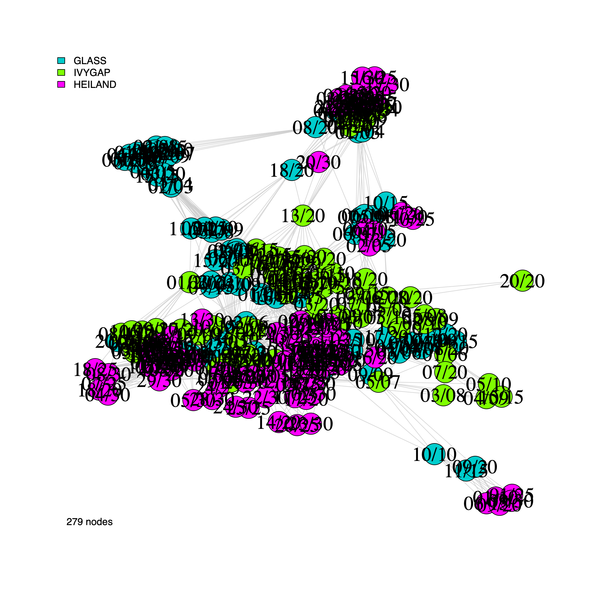
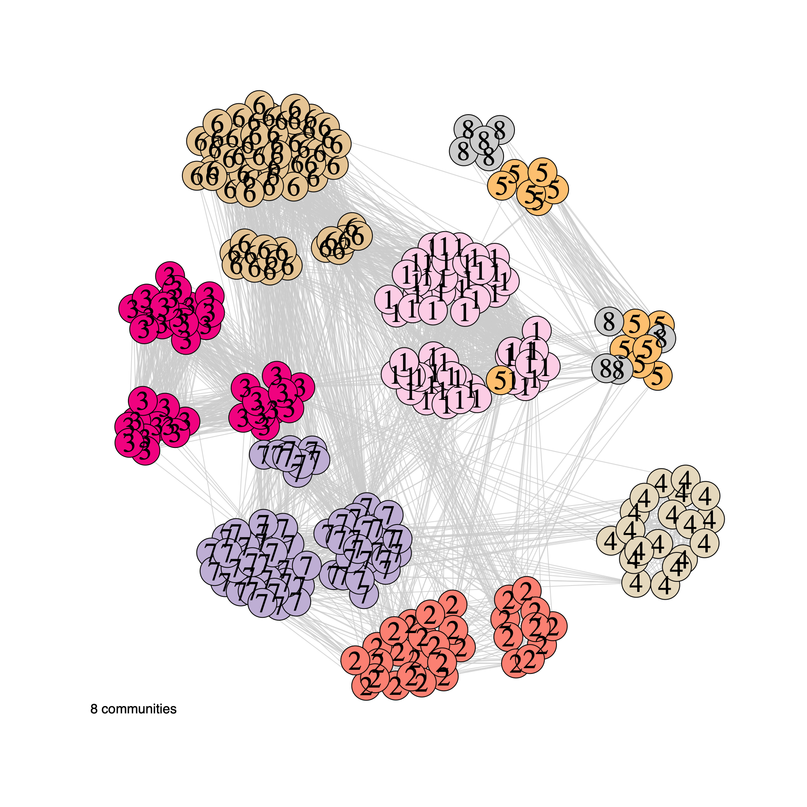
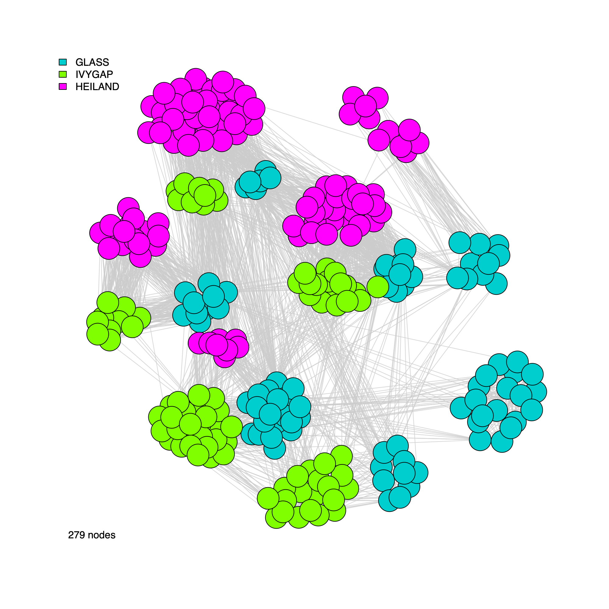
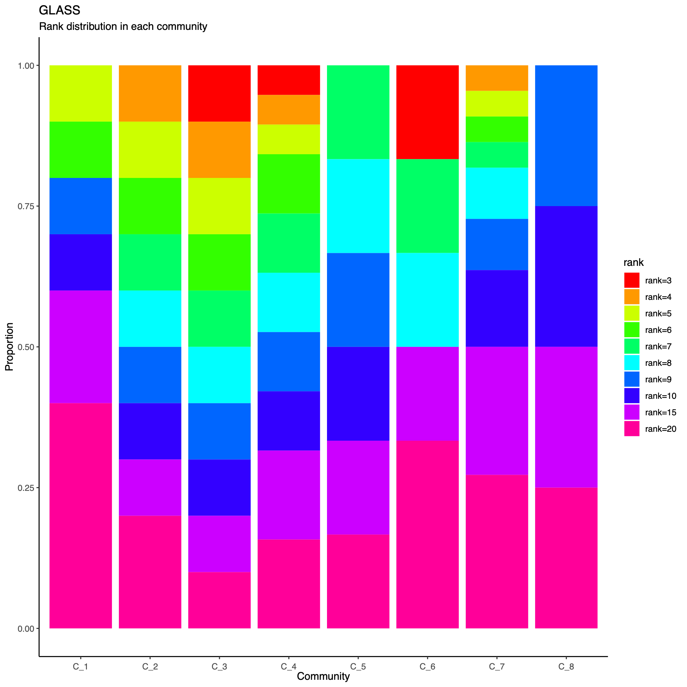
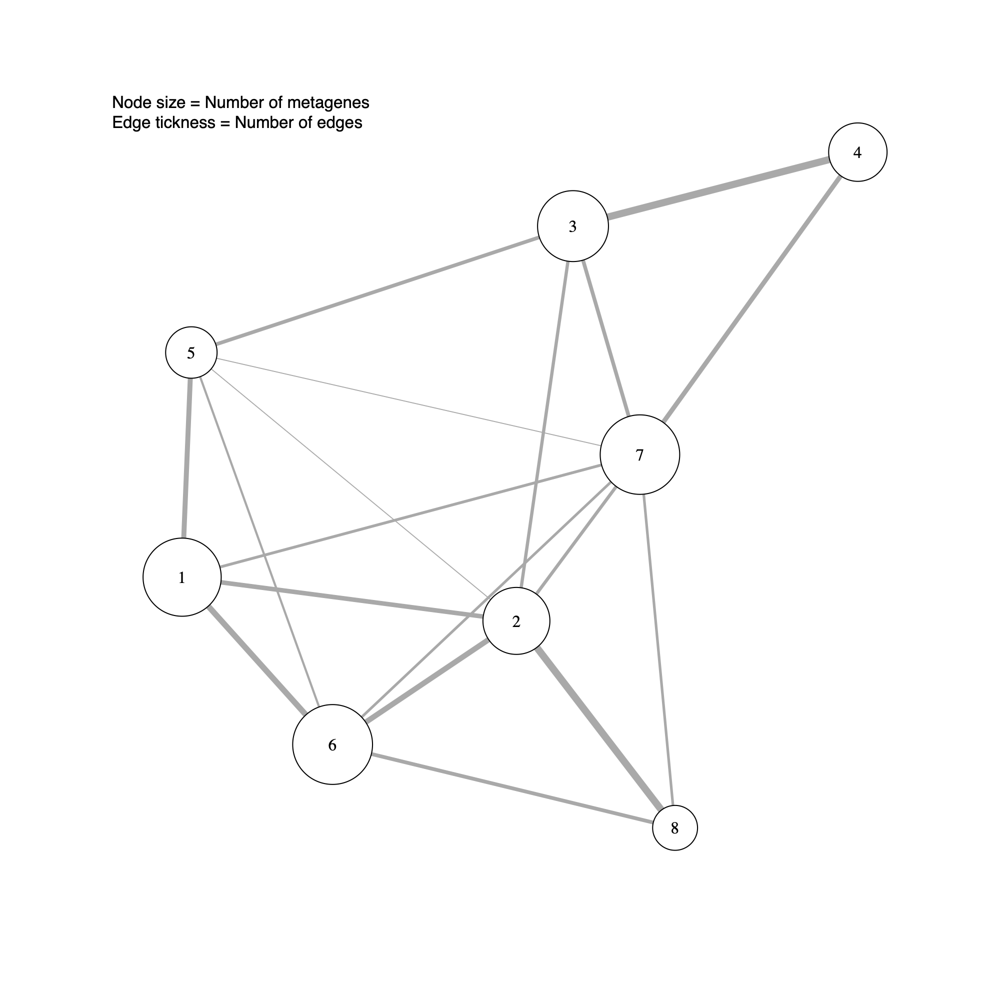

# Introduction

  - This demo script demonstrates how to visualize the Spatial Omics Set
  (`soSet`) to facilitate interpretation of the derived metagene
  structure and cross-cohort relationships.
  - Each figure generated below is accompanied by a detailed explanation
  describing its rationale, key features, and guidance for
  interpretation.

## Directory settings

  - This block defines the working directory used throughout the demo to
  store downloaded inputs and generated outputs.

``` r
# If you want to use a user-defined output directory, 
# uncomment and set the download_dir parameter.

# download_dir <- "/path/to/download" # where soObj.RDS is located

if (exists("download_dir") && is.character(download_dir) && length(download_dir) == 1 && 
        nzchar(download_dir)) {
        download_dir <- download_dir
} else {
        download_dir <- tools::R_user_dir("sotk2", "data")
}
```

## Load the spatial omics object

  - We load the previously generated `soObj` object, which contains the
  correlation network and community detection results produced in the
  earlier steps of the workflow.
  - The script first attaches the `sotk2` package and then checks whether
  `soObj.RDS` is present in `download_dir`.

``` r
library(sotk2)

if (file.exists(file.path(download_dir, "soObj.RDS"))) {
        soObj <- readRDS(file.path(download_dir, "soObj.RDS"))
} else {
        stop("ERROR: the soObj.RDS file not found.")
}
```

## Correlation coefficient density

  - This panel summarizes the distribution of pairwise correlation
  coefficients within and between datasets using a matrix-style layout.
  - For three datasets, the figure comprises six histograms corresponding
  to all dataset pairs.
    1. The diagonal panels display within-dataset correlation
    distributions.
    2. The lower-left panels show between-dataset correlation distributions
    for each dataset pair, whereas the upper-right panels provide the
    corresponding overall coefficient distributions as a reference for
    comparison.
  - The `filename` argument controls output: setting `filename = NULL`
  prints to the active graphics device, whereas providing a path writes
  the figure to disk.

``` r
plotCorrDensity(soObj@SOSet, filename = NULL)
```



## Visualization parameters

  - This section defines core visualization parameters that control the
  appearance and readability of the network plots.
  - Specifically, `nodeSize` and `nodeLabelSize` determine the size of
  nodes and the corresponding label text, respectively, while
  `edgeAlpha` sets the transparency of edges to reduce visual clutter in
  dense networks and to emphasize higher-level structure.

``` r
nodeSize        <- 10
nodeLabelSize   <- 2
edgeAlpha       <- 0.8
```

## Correlation-network plots

- In this section, we generate network visualizations derived from the
  correlation graph stored in `soObj`.
- The plotting function supports flexible display options, allowing
  users to
  1.  Toggle vertex labels (`label = TRUE/FALSE`)
  2.  Color or annotate nodes by cohort membership (`annot = "cohort"`)
      or by inferred community assignment (`annot = "community"`)
  3.  Render either an unweighted network (`weighted = FALSE`) or a
      weighted network (`weighted = TRUE`, where edge widths reflect
      correlation strength)

``` r
plotNetwork(soObj, label = FALSE, annot = "cohort", weighted = FALSE, edgeAlpha = edgeAlpha, filename = NULL, vertexSize = nodeSize, vertexLabelCex = nodeLabelSize)
```



``` r
plotNetwork(soObj, label = TRUE, annot = "cohort", weighted = FALSE, edgeAlpha = edgeAlpha, filename = NULL, vertexSize = nodeSize, vertexLabelCex = nodeLabelSize) 
```



``` r
plotNetwork(soObj, label = FALSE, annot = "community", weighted = FALSE, edgeAlpha = edgeAlpha, filename = NULL, vertexSize = nodeSize, vertexLabelCex = nodeLabelSize)
```


``` r
plotNetwork(soObj, label = TRUE, annot = "community", weighted = FALSE, edgeAlpha = edgeAlpha, filename = NULL, vertexSize = nodeSize, vertexLabelCex = nodeLabelSize)
```


``` r
plotNetwork(soObj, label = FALSE, annot = "community", weighted = TRUE, edgeAlpha = edgeAlpha, filename = NULL, vertexSize = nodeSize, vertexLabelCex = nodeLabelSize)
```


``` r
plotNetwork(soObj, label = TRUE, annot = "community", weighted = TRUE, edgeAlpha = edgeAlpha, filename = NULL, vertexSize = nodeSize, vertexLabelCex = nodeLabelSize)
```



``` r
plotNetwork(soObj, label = FALSE, annot = "cohort", weighted = TRUE, edgeAlpha = edgeAlpha, filename = NULL, vertexSize = nodeSize, vertexLabelCex = nodeLabelSize)
```



``` r
plotNetwork(soObj, label = TRUE, annot = "cohort", weighted = TRUE, edgeAlpha = edgeAlpha, filename = NULL, vertexSize = nodeSize, vertexLabelCex = nodeLabelSize)
```


## Community network properties

  - The following plot summarizes community composition by reporting the
  number of metagenes assigned to each detected community, stratified by
  dataset.
    1. This visualization provides a compact overview of how communities are
  supported across cohorts and highlights communities that are
  cohort-specific versus broadly shared.
    2. Metagenes derived from higher-rank factorizations often capture increasingly sample-specific patterns rather than broadly conserved biological programs. Consequently, communities dominated by high-rank metagenes may reflect cohort- or sample-idiosyncratic structure and may be less likely to represent generalizable biological signals that are reproducibly observed across datasets.

``` r
statComm(soObj, filename = NULL)
```




## Community-level network layout

  - This step generates a community-level network in which each node
  represents a detected community.
  - Node size reflects the number of metagenes (GEPs) assigned to the
  community, and edge thickness summarizes the extent of connectivity
  between communities (that is, the number of inter-community edges in
  the underlying metagene network).
  - In subsequent sections, this community-level layout will be augmented
  with sample-level annotations to support biological interpretation of
  the inferred modules.

``` r
plotCommNetwork(soObj, vertexInfo = NULL, filename = NULL)
```


